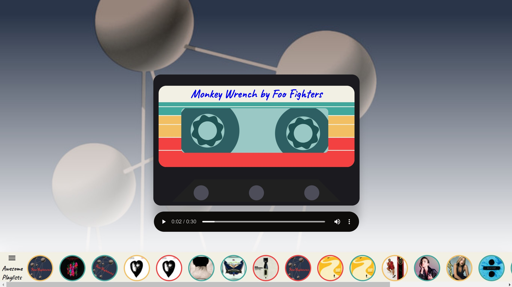
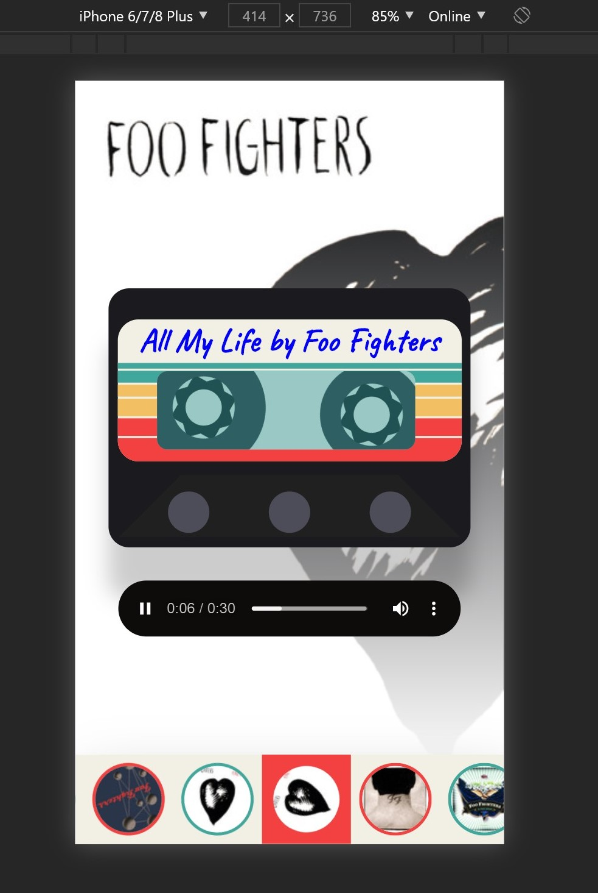

# Discman-Spotify-API-
A simple but functional Music Player builded with React.js

## How this Music Player work
* first its getting my playlist from spotify through the API request
```
https://api.spotify.com/v1/me/playlist
```
* then its render it track on the bottom of the Player showing the tracks`s name and album picture

* when we click on the album picture the track information goes to player on the center of our screen and plays automatic, and a animation on our 
cassette tape start to running, and the album picture also goes to the background behind the tape and a player shows just below the tape.

## and it is responsive to mobile



## link to surge:

<https://discman-spotify.surge.sh>

